

    

    📫 Reach me at
    <a href="https://www.chandu-sasidharan.de">www.chandu-sasidharan.de</a>

    I am a Senior Full Stack Developer who takes SaaS products from concept to
    production. My work covers the whole system: React and Next.js frontends,
    Node.js backends, PostgreSQL, and cloud infrastructure on AWS and
    Hetzner, with the CI/CD pipelines and observability needed to keep it
    running.

    Recent work centres on multi-tenant platforms and AI-enabled products:
    shared identity and authorization, Stripe subscriptions with metered
    usage, retrieval-augmented generation (RAG) pipelines, and the data
    ingestion, orchestration, and cost controls that make AI features
    dependable in real workflows. I care about clean architecture, pragmatic
    decisions, and software that solves an actual business problem.

## Selected Projects

<table>
    <tr>
        <td width="50%"><h3>Backoffice</h3></td>
        <td width="50%">
            
            Next.js |
            
            Node.js |
            
            Express |
            
            PostgreSQL |
            
            OpenAI |
            
            Stripe |
            
            Docker |
            
            Caddy |
            
            GitHub CI/CD
        </td>
    </tr>
    <tr>
        <td width="50%">
            

                Backoffice is a multi-tenant SaaS product for owner-run
                businesses. It brings CRM, catalog, bookings, calendars, and
                customer communication into one workspace, with the business's
                own mailbox connected and AI reply drafting grounded in the
                workspace's own data. I designed and built the platform behind
                it: a shared backend that owns identity, tenancy,
                authorization, Stripe subscriptions, and metered AI usage,
                serving several Next.js applications from one TypeScript
                monorepo. Every service ships as a Docker image through GitHub
                Actions to staging and production behind a Caddy edge.
            

        </td>
        <td width="50%">
            <a href="https://backoffice.mindfulltechnologies.com">
                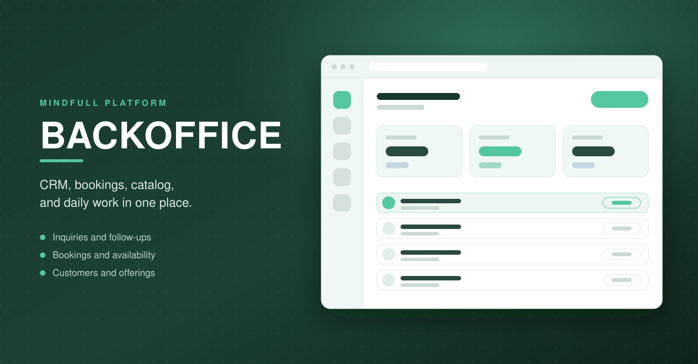
            </a>
        </td>
    </tr>
</table>
<table>
    <tr>
        <td width="50%"><h3>Kakapo</h3></td>
        <td width="50%">
            
            Next.js |
            
            Node.js |
            
            PostgreSQL |
            
            OpenAI |
            
            Tailwind |
            
            Docker
        </td>
    </tr>
    <tr>
        <td width="50%">
            

                Kakapo is a chatbot builder that lets a business train an AI
                assistant on its own content and embed it anywhere. Bots answer
                from tenant-owned knowledge through a retrieval-augmented
                generation (RAG) pipeline, delivered as a share page, an iframe,
                a floating chat bubble, or a protected API. I built it end to
                end, including data ingestion, vector storage, AI
                orchestration, caching, observability, and deployment. It began
                as a standalone product and now runs on the same platform as
                Backoffice, where it also powers AI features in other products.
            

        </td>
        <td width="50%">
            <a href="https://kakapo.chat">
                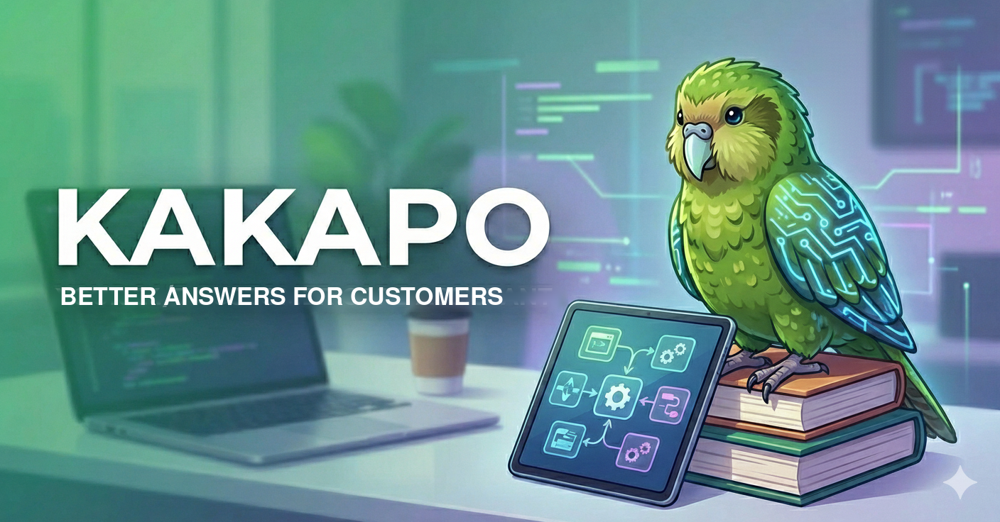
            </a>
        </td>
    </tr>
</table>
<table>
    <tr>
        <td width="50%"><h3>Bio Baum Bauer</h3></td>
        <td width="50%">
            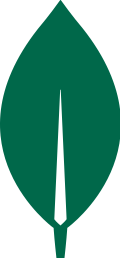
            MongoDB |
            
            Express |
            
            React |
            
            Tailwind |
            
            Stripe |
            
            AWS
        </td>
    </tr>
    <tr>
        <td width="50%">
            

                Bio Baum Bauer is a tree-sponsorship shop built with Solawi
                Zabergäu. Supporters browse available trees, sponsor one,
                receive a personalised certificate, and follow the impact of
                their contribution over time. The platform handles the whole
                flow from discovery to Stripe payment, making sustainable
                giving simple for a wide audience.
            

        </td>
        <td width="50%">
            <a href="https://biobaumbauer.de/">
                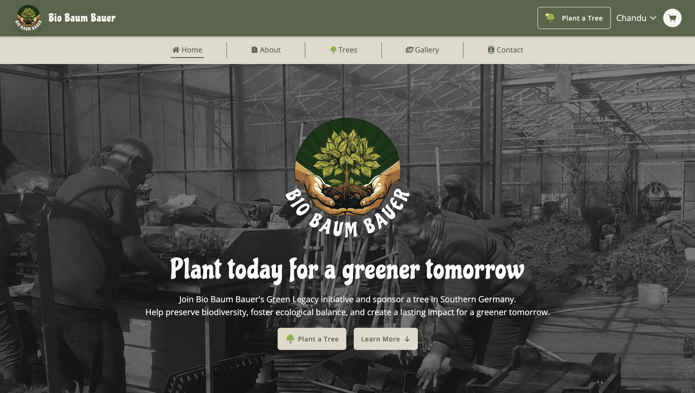
            </a>
        </td>
    </tr>
</table>
<table>
    <tr>
        <td width="50%"><h3>Canoe Ville</h3></td>
        <td width="50%">
            
            HTML |
            
            CSS |
            
            Sass |
            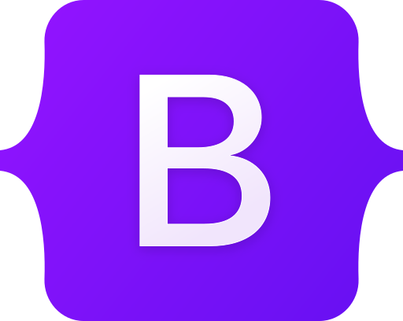
            Bootstrap |
            
            React |
            
            AWS
        </td>
    </tr>
    <tr>
        <td width="50%">
            

                Redesigned the website of Canoe Ville, a resort in Kerala, to
                put its houseboat-themed accommodation and event spaces at the
                centre of the experience. The new design and content lifted
                page visits by 70% and inquiries by 40%.
            

        </td>
        <td width="50%">
            <a href="https://www.canoeville.com/">
                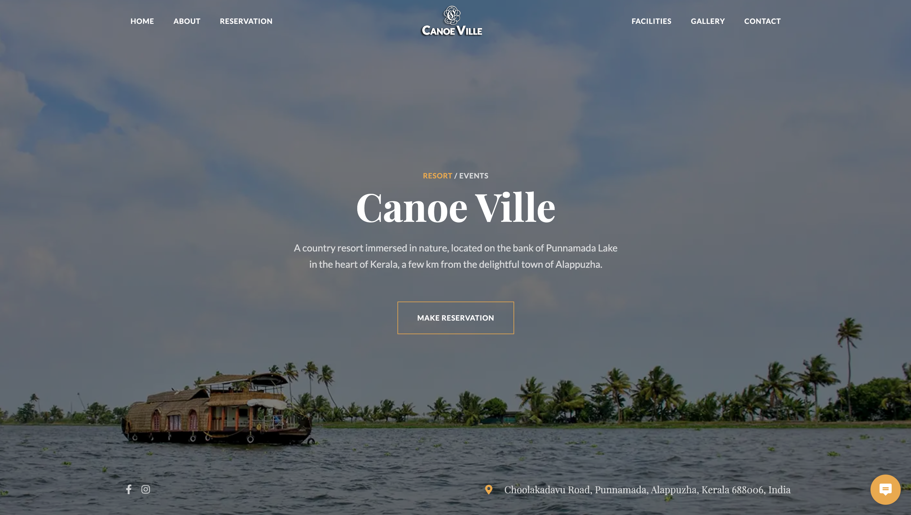
            </a>
        </td>
    </tr>
</table>
<table>
    <tr>
        <td width="50%"><h3>Curriculum CMS</h3></td>
        <td width="50%">
            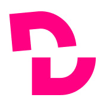
            Decap |
            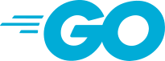
            Go |
            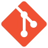
            git-gateway |
            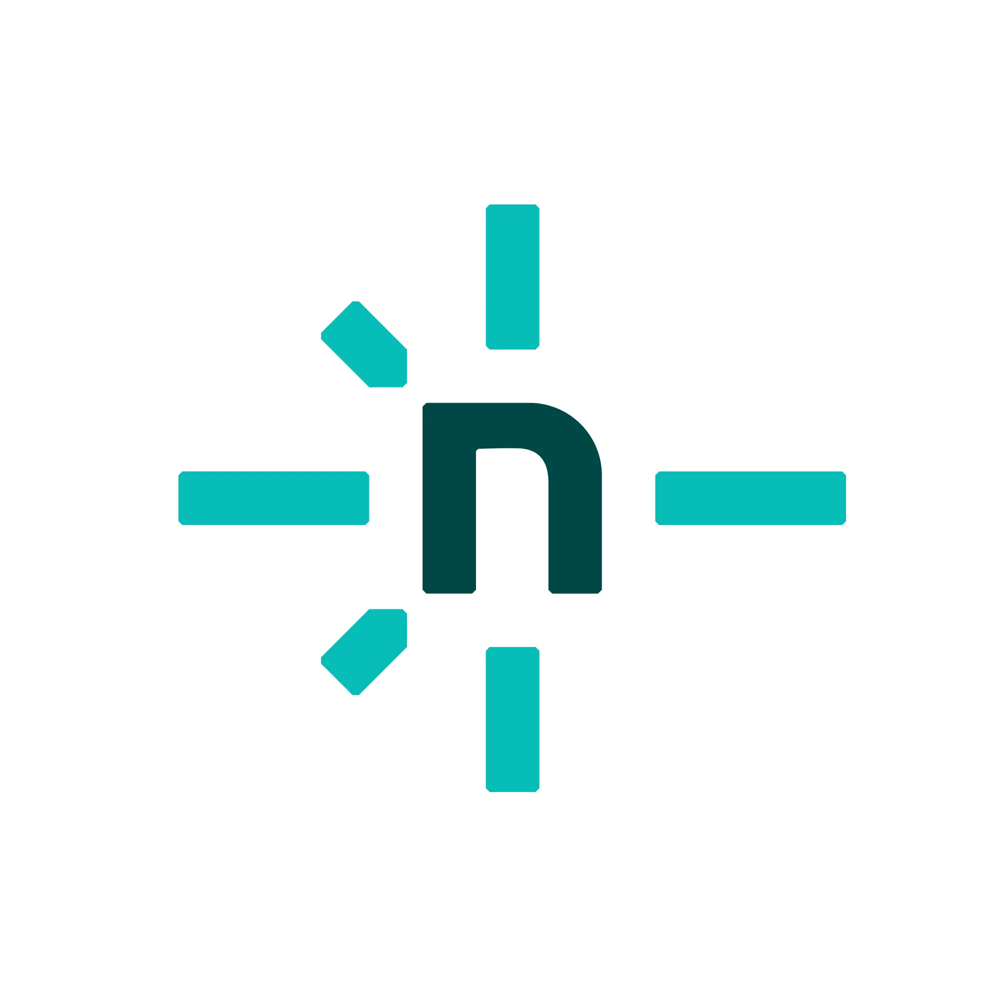
            GoTrue |
            
            Google OAuth |
            
            Caddy |
            
            Docker |
            
            GitHub CI/CD
        </td>
    </tr>
    <tr>
        <td width="50%">
            

                Curriculum CMS standardises how course curricula are written and
                maintained at DCI. Built on Decap CMS with custom widgets,
                GoTrue authentication, and git-gateway, it gives non-technical
                staff a friendly editor while every change lands in Git, so
                updates stay consistent and reviewable.
            

        </td>
        <td width="50%">
            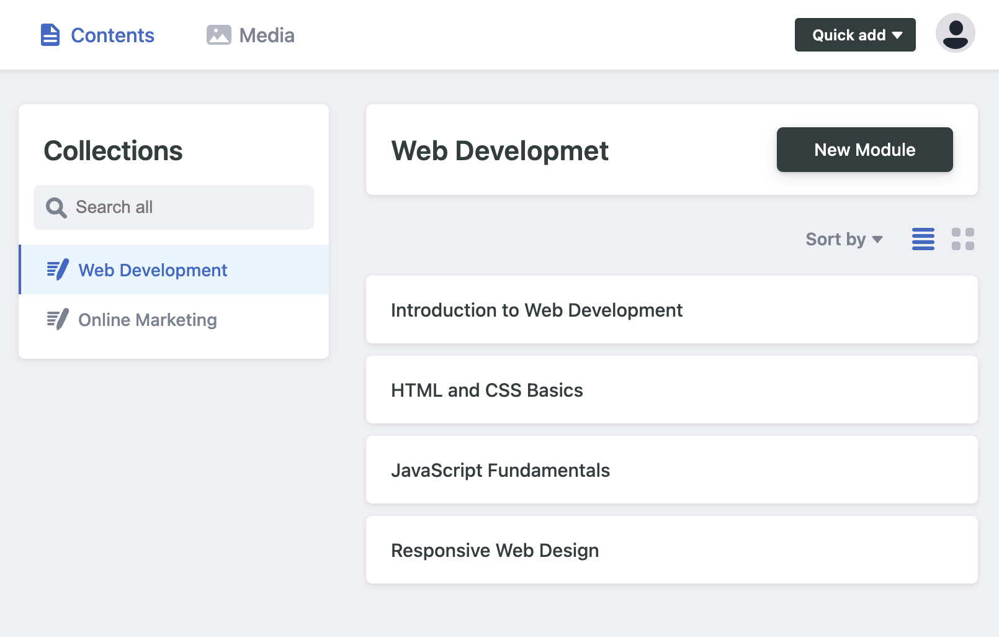
        </td>
    </tr>
</table>
<table>
    <tr>
        <td width="50%"><h3>Grossjungig</h3></td>
        <td width="50%">
            
            MongoDB |
            
            Express |
            
            React |
            
            Material UI |
            
            AWS
        </td>
    </tr>
    <tr>
        <td width="50%">
            

                Grossjungig is an intergenerational co-living marketplace that
                connects older adults with young people in big cities. Built on
                the MERN stack, it offers geo-search through OpenStreetMap,
                stores images on AWS S3, and ships with a react-admin panel for
                managing users and listings. A CI/CD pipeline keeps deployments
                stable.
            

        </td>
        <td width="50%">
            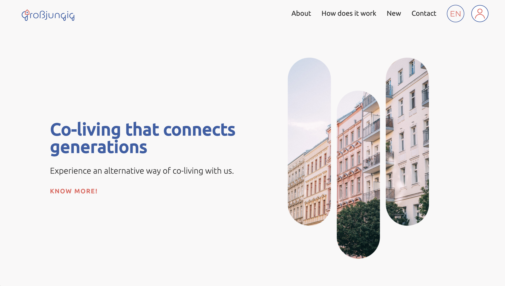
        </td>
    </tr>
</table>
