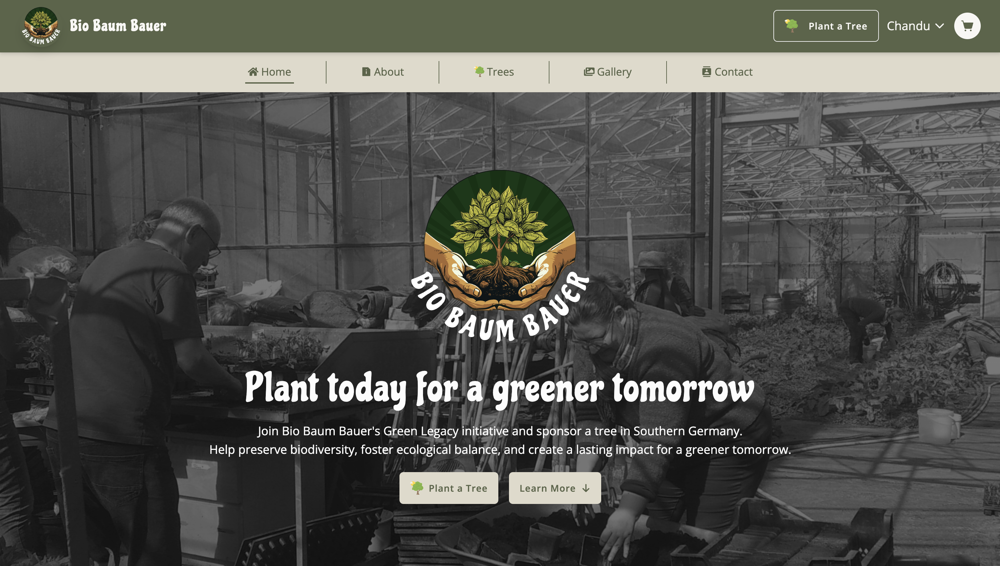
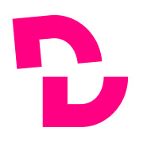
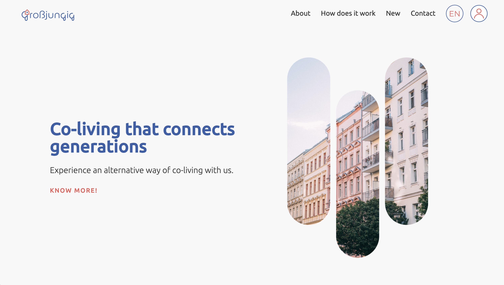

    

    📫 Reach me at
    <a href="https://www.chandu-sasidharan.de">www.chandu-sasidharan.de</a>

    I am a Senior Full Stack Developer with extensive experience building and
    scaling production-grade SaaS platforms and AI-enabled web applications. I
    specialize in designing end-to-end systems using modern frontend
    architectures, robust backend services, and cloud-native infrastructure,
    with a strong focus on reliability, security, and maintainability. I have
    taken multiple products from concept to production using React, Next.js,
    TypeScript, Node.js, and cloud services on AWS and DigitalOcean. My work
    includes multi-tenant SaaS platforms, AI-powered applications using
    retrieval-augmented generation (RAG), secure authentication systems,
    administrative dashboards, Stripe-based payment flows, and automated CI/CD
    pipelines. I have strong hands-on experience integrating AI capabilities
    into real product workflows, focusing on data ingestion, orchestration,
    observability, and cost-efficient operation. I value clean architecture,
    pragmatic decision-making, and building systems that solve real problems at
    scale.

## Selected Projects

<table>
    <tr>
        <td width="50%"><h3>Kakapo</h3></td>
        <td width="50%">
            
            Next.js |
            
            Supabase |
            
            Docker |
            
            Tailwind
        </td>
    </tr>
    <tr>
        <td width="50%">
            

                Kakapo is a production-grade SaaS platform that enables
                businesses to create, train, and embed AI-powered chatbots using
                their own data into their website. I designed and implemented
                the system end to end, including multi-tenant authentication,
                bot management, and a retrieval-augmented generation (RAG)
                pipeline built on Supabase vector storage. The platform supports
                ingesting URLs and documents, orchestrates AI workflows using
                LangChain and OpenAI, and incorporates caching and observability
                to ensure reliable and cost-efficient operation. I also built
                multiple integration surfaces, including a public share page,
                iframe embeds, and a lightweight client-side script, allowing
                the chatbot to be seamlessly embedded into any website. The
                entire system was containerized and deployed using Docker,
                Caddy, and automated CI/CD pipelines.
            

        </td>
        <td width="50%">
            
        </td>
    </tr>
</table>
<table>
    <tr>
        <td width="50%"><h3>Bio Baum Bauer</h3></td>
        <td width="50%">
            
            MongoDB |
            
            Express |
            
            React |
            
            Tailwind |
            
            Stripe |
            
            AWS
        </td>
    </tr>
    <tr>
        <td width="50%">
            

                BioBaumBauer is a production-ready web platform that combines a
                customer-facing e-commerce experience with a robust backend and
                administrative dashboard. I designed and implemented the system
                end to end using a React-based storefront and a Node.js/Express
                API backed by MongoDB. The platform supports secure checkout
                flows using Stripe, content and inventory management via an
                AdminJS dashboard, and integrations for transactional email and
                media storage. I structured the project as a lightweight
                monorepo to share tooling across services while keeping frontend
                and backend concerns clearly separated. The entire application
                was containerized and deployed using Docker, with dedicated
                staging and production pipelines powered by GitHub Actions,
                enabling reliable, repeatable deployments across environments.
            

        </td>
        <td width="50%">
            
        </td>
    </tr>
</table>
<table>
    <tr>
        <td width="50%"><h3>Canoe Ville</h3></td>
        <td width="50%">
            
            HTML |
            
            CSS |
            
            Sass |
            
            Bootstrap |
            
            React |
            
            AWS
        </td>
    </tr>
    <tr>
        <td width="50%">
            

                Redesigned the Canoe Ville website with a user-centric approach
                to highlight the resort’s unique offerings, including
                houseboat-themed accommodations and scenic event spaces. The
                optimized design and enriched content increased page visits by
                70% and boosted inquiries by 40%, enhancing Canoe Ville’s
                reputation as a must-visit destination in Kerala.
            

        </td>
        <td width="50%">
            
        </td>
    </tr>
</table>
<table>
    <tr>
        <td width="50%"><h3>Curriculum CMS</h3></td>
        <td width="50%">
            
            Decap |
            
            Go |
            
            git-gateway |
            
            gotrue |
            
            Google Oauth |
            
            Caddy |
            
            Docker
            
            GutHub CI/CD
        </td>
    </tr>
    <tr>
        <td width="50%">
            

                Curriculum CMS is a custom solution built to standardize and
                manage course curricula at DCI. Developed with Decap (React),
                gotrue, git-gateway, GitHub, and decap custom widgets, this
                system provides easy access for non-technical users -
                streamlining curriculum updates and ensuring consistency.
            

        </td>
        <td width="50%">
            
        </td>
    </tr>
</table>
<table>
    <tr>
        <td width="50%"><h3>Grossjungig</h3></td>
        <td width="50%">
            
            MongoDB |
            
            Express |
            
            React |
            
            Material UI |
            
            AWS
        </td>
    </tr>
    <tr>
        <td width="50%">
            

                Grossjungig is an intergenerational co - living marketplace that
                connects older adults and youth in big cities, fostering social
                cohesion and a more connected world. Built with the MERN stack,
                the platform integrates geo-search functionality via
                OpenStreetMap and leverages AWS S3 for image storage. A
                dedicated admin panel - developed using react-admin streamlines
                user data management and administrative tasks, while a well -
                maintained CI/CD pipeline ensures stable deployments and
                seamless updates.
            

        </td>
        <td width="50%">
            
        </td>
    </tr>
</table>
